---
## Front matter
lang: ru-RU
title: Презентация по лабораторной работе №1
subtitle: Операционные системы
author:
  - Морозова М. В.
institute:
  - Российский университет дружбы народов, Москва, Россия
date: 02 марта 2024

## i18n babel
babel-lang: russian
babel-otherlangs: english

## Formatting pdf
toc: false
toc-title: Содержание
slide_level: 2
aspectratio: 169
section-titles: true
theme: metropolis
header-includes:
 - \metroset{progressbar=frametitle,sectionpage=progressbar,numbering=fraction}
 - '\makeatletter'
 - '\beamer@ignorenonframefalse'
 - '\makeatother'

## Fonts
mainfont: PT Serif
romanfont: PT Serif
sansfont: PT Sans
monofont: PT Mono
mainfontoptions: Ligatures=TeX
romanfontoptions: Ligatures=TeX
sansfontoptions: Ligatures=TeX, Scale=MatchLowercase
monofontoptions: Scale=MatchLowercase, Scale=0.9
---

## Цели и задачи

- Целью работы является приобретение практических навыков установки операционной системы на виртуальную машину, настройки минимально
 необходимых для дальнейшей работы сервисов.
- Создать виртуальную машину
- установить операционную систему
- установить программное обеспечение для создания документации

## Выполнение лабораторной работы

После установки обновляем все пакеты. (рис. 1).

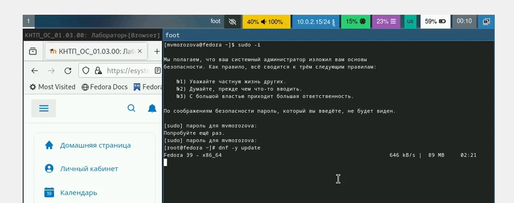{width=70%}

## Выполнение лабораторной работы

Устанавливаем программу для удобства работы в консоли (рис. 2).

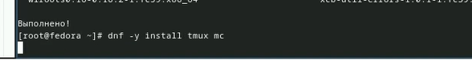{width=70%}

## Выполнение лабораторной работы

Установка программного обеспечения для автоматического обновления. (рис. 3).

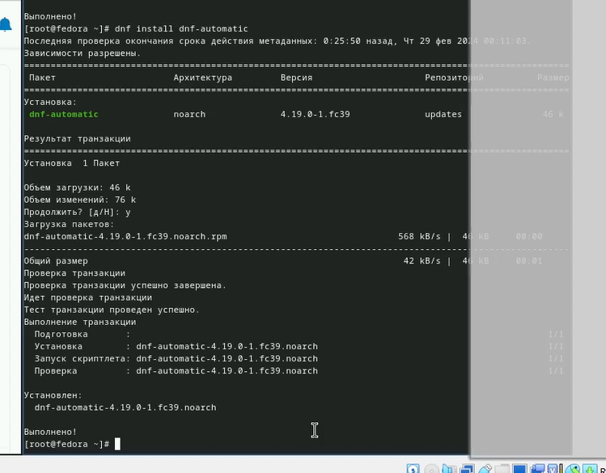{width=70%}

## Выполнение лабораторной работы

Запускаем таймер (рис. 4).

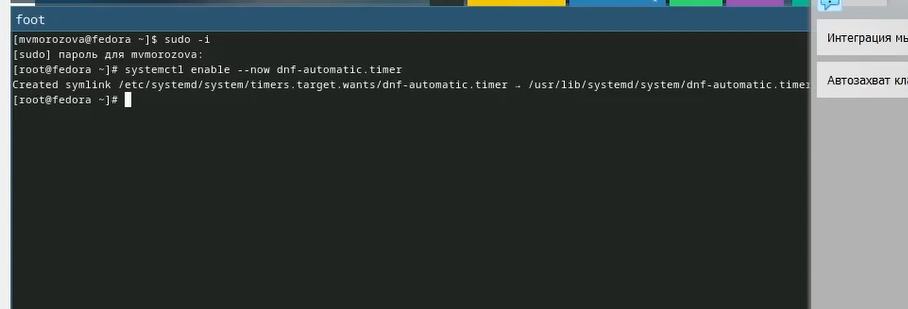{width=70%}

## Выполнение лабораторной работы

Поменяли значение enforsing на  permissive (рис. 5).

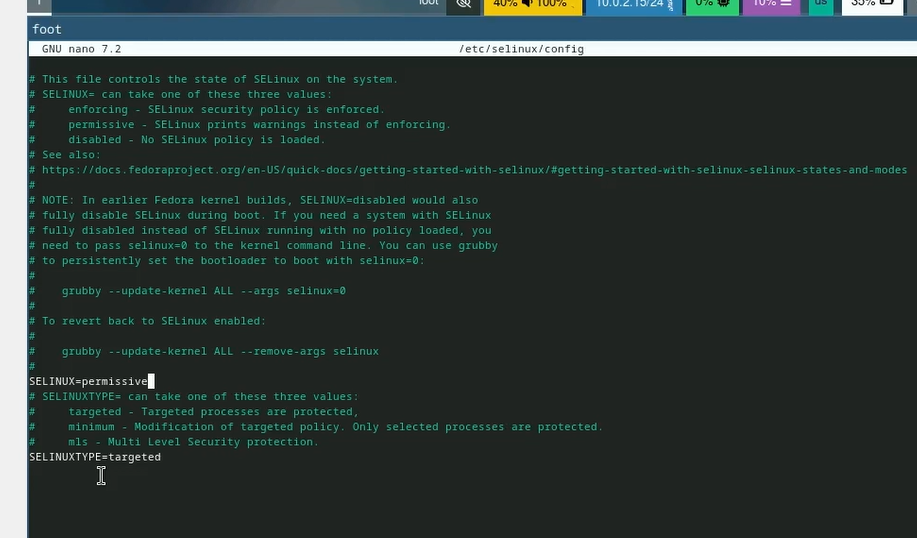{width=70%}

## Выполнение лабораторной работы

Устанавливаем средства разработки. (рис. 6).

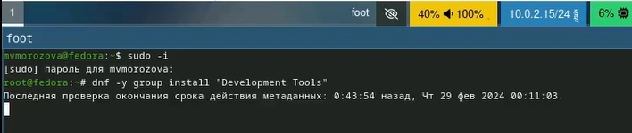{width=70%}

## Выполнение лабораторной работы

Устанавливаем пакет DKMS (рис. 7]).

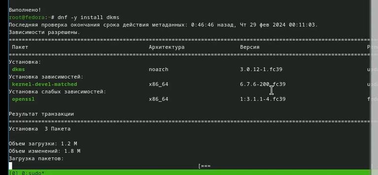{width=70%}

## Выполнение лабораторной работы

Подмонтировали диск и установили драйвера.(рис. 8).

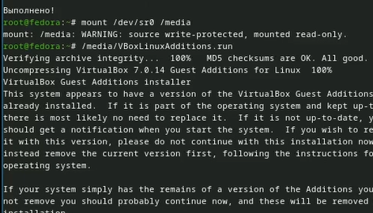{width=70%}

## Выполнение лабораторной работы

Создали конфигурационный файл, отредактировали его. (рис. 9).

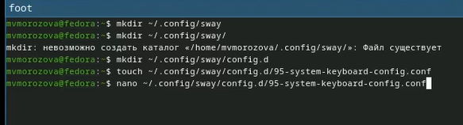{width=70%}

## Выполнение лабораторной работы

Установили имя хоста, проверили его, добавили своего пользователя в группу  vboxsf (рис. 10).

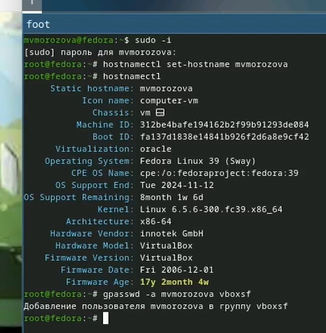{width=70%}

## Выполнение лабораторной работы

Подключаем разделяемую папку в хостовой системе (рис. 11).

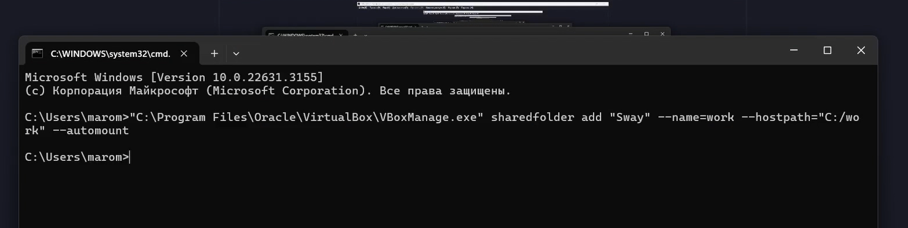{width=70%}

## Выполнение лабораторной работы

Установка pandoc для работки с языком разметки markdown(рис. 12).

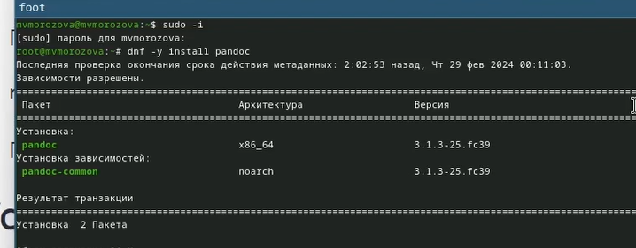{width=70%}

## Выполнение лабораторной работы

Распаковали архивы и поместили программы  в необходимый каталог, установили дистрибутив texlive (рис. 13).

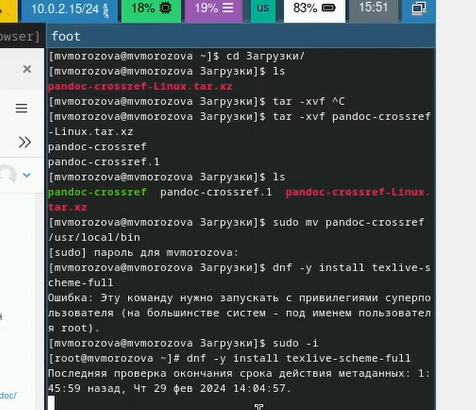{width=70%}

## Выполнение дополнительного задания

Выполнили команду dmesg для просмотра последовательности загрузки системы (рис. 14).

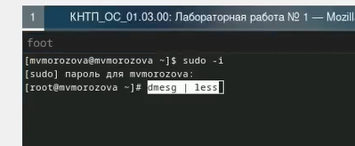{width=70%}

## Выполнение дополнительного задания

Получили информацию о версии ядра Linux c помощью dmesg (рис. 15).

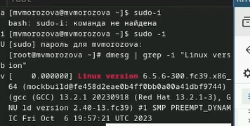{width=70%}

## Выполнение дополнительного задания

Получили информацию о частоте процессора модели процессора объёме доступной оперативной памяти типе обнаруженного гипервизора типе>
 системы корневого раздела (рис. 16).

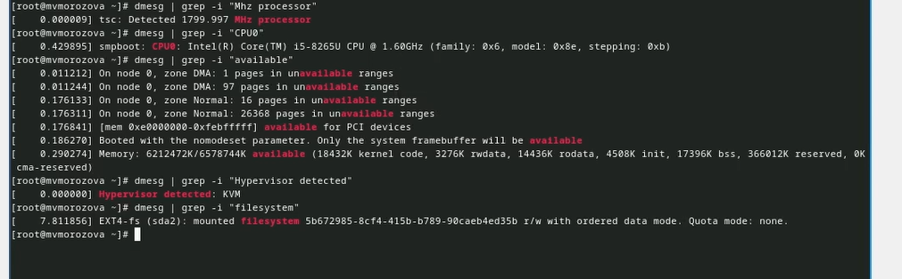{width=70%}

## Выводы

Были приобретены навыки установки операционной системы на виртуальную машину, сделана настройка минимально необходимых для дальней>
 работы сервисов.
