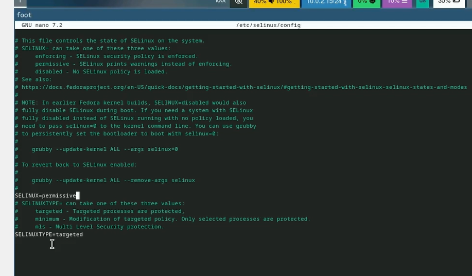

---
## Front matter
title: "Отчёт по лабораторной работе №1"
subtitle: "Операционные системы"
author: "Морозова Мария Вячеславовна"

## Generic otions
lang: ru-RU
toc-title: "Содержание"

## Bibliography
bibliography: bib/cite.bib
csl: pandoc/csl/gost-r-7-0-5-2008-numeric.csl

## Pdf output format
toc: true # Table of contents
toc-depth: 2
lof: true # List of figures
lot: true # List of tables
fontsize: 12pt
linestretch: 1.5
papersize: a4
documentclass: scrreprt
## I18n polyglossia
polyglossia-lang:
  name: russian
  options:
	- spelling=modern
	- babelshorthands=true
polyglossia-otherlangs:
  name: english
## I18n babel
babel-lang: russian
babel-otherlangs: english
## Fonts
mainfont: PT Serif
romanfont: PT Serif
sansfont: PT Sans
monofont: PT Mono
mainfontoptions: Ligatures=TeX
romanfontoptions: Ligatures=TeX
sansfontoptions: Ligatures=TeX,Scale=MatchLowercase
monofontoptions: Scale=MatchLowercase,Scale=0.9
## Biblatex
biblatex: true
biblio-style: "gost-numeric"
biblatexoptions:
  - parentracker=true
  - backend=biber
  - hyperref=auto
  - language=auto
  - autolang=other*
  - citestyle=gost-numeric
## Pandoc-crossref LaTeX customization
figureTitle: "Рис."
tableTitle: "Таблица"
listingTitle: "Листинг"
lofTitle: "Список иллюстраций"
lotTitle: "Список таблиц"
lolTitle: "Листинги"
## Misc options
indent: true
header-includes:
  - \usepackage{indentfirst}
  - \usepackage{float} # keep figures where there are in the text
  - \floatplacement{figure}{H} # keep figures where there are in the text
---

# Цель работы

Целью работы является приобретение практических навыков установки операционной системы на виртуальную машину, настройки минимально
 необходимых для дальнейшей работы сервисов. 

# Задание

Создать виртуальную машину, установить операционную систему, установить программное обеспечение для создания документации, выполнить
 дополнительные задания.

# Выполнение лабораторной работы

После установки обновляем все пакеты. (рис. [-@fig:001]).

{#fig:001 width=70%}

Устанавливаем программу для удобства работы в консоли (рис. [-@fig:002]).

{#fig:002 width=70%}

Установка программного обеспечения для автоматического обновления. (рис. [-@fig:003]).

{#fig:003 width=70%}

Запускаем таймер (рис. [-@fig:004]).

{#fig:004 width=70%}

Поменяли значение enforsing на  permissive (рис. [-@fig:005]).

{#fig:005 width=70%}

Устанавливаем средства разработки. (рис. [-@fig:006]).

{#fig:006 width=70%}

Устанавливаем пакет DKMS (рис. [-@fig:007]).

{#fig:007 width=70%}

Подмонтировали диск и установили драйвера.(рис. [-@fig:008]).

{#fig:008 width=70%}

Создали конфигурационный файл, отредактировали его. (рис. [-@fig:009]).

{#fig:009 width=70%}

Установили имя хоста, проверили его, добавили своего пользователя в группу  vboxsf (рис. [-@fig:010]).

{#fig:010 width=70%}

Подключаем разделяемую папку в хостовой системе (рис. [-@fig:011]).

{#fig:011 width=70%}

Установка pandoc для работки с языком разметки markdown(рис. [-@fig:012]).

{#fig:012 width=70%}

Распаковали архивы и поместили программы  в необходимый каталог, установили дистрибутив texlive (рис. [-@fig:013]).

{#fig:013 width=70%}

# Выполнение дополнительного задания

Выполнили команду dmesg для просмотра последовательности загрузки системы (рис. [-@fig:014]).

{#fig:014 width=70%}

Получили информацию о версии ядра Linux c помощью dmesg (рис. [-@fig:015]).

{#fig:015 width=70%}

Получили информацию о частоте процессора модели процессора объёме доступной оперативной памяти типе обнаруженного гипервизора типе файловой
 системы корневого раздела (рис. [-@fig:016]).

{#fig:016 width=70%}

# Ответы на контрольные вопросы

1.Учётная запись содержит необходимые данные для идентификации пользователя при подключении к системе.(Системное имя, идентификатор
 пользователя)
2.команда --help, cd, ls, -du имя каталога, mkdir/rmdir, touch/rm, chmod, history.
3.Файловая система  - порядок, определяющий способ организации хранения и именования данных на различных носителях информации. Например,
 FAT32 - пространство из трёх частей: зона хранения файлов, область служебных структур, форма указателей в виде таблиц.
4.С помощью команды  df или с помощью утилиты  mount.
5.Сначала смотрим какой id у процесса,  для этого используем команду ps. Дальше в терминале пишем команду
   kill id процесса Или можно использовать killall, которая удалит все процессы.

# Выводы

Были приобретены навыки установки операционной системы на виртуальную машину, сделана настройка минимально необходимых для дальнейшей
 работы сервисов.
