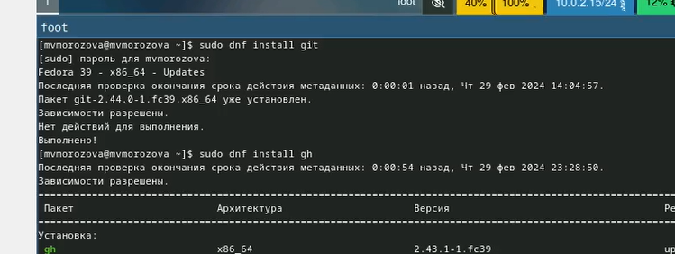
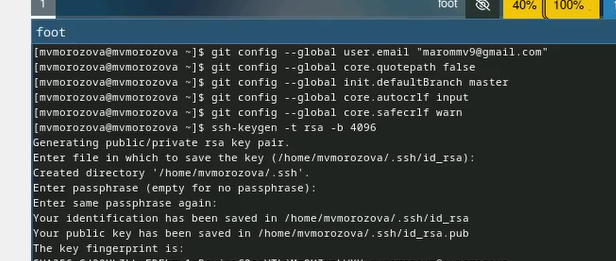
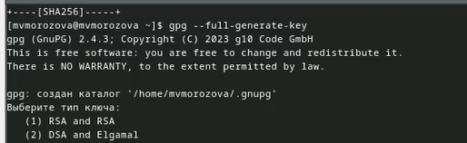
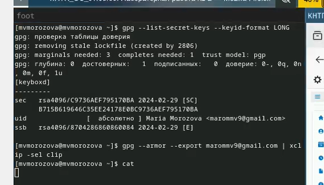
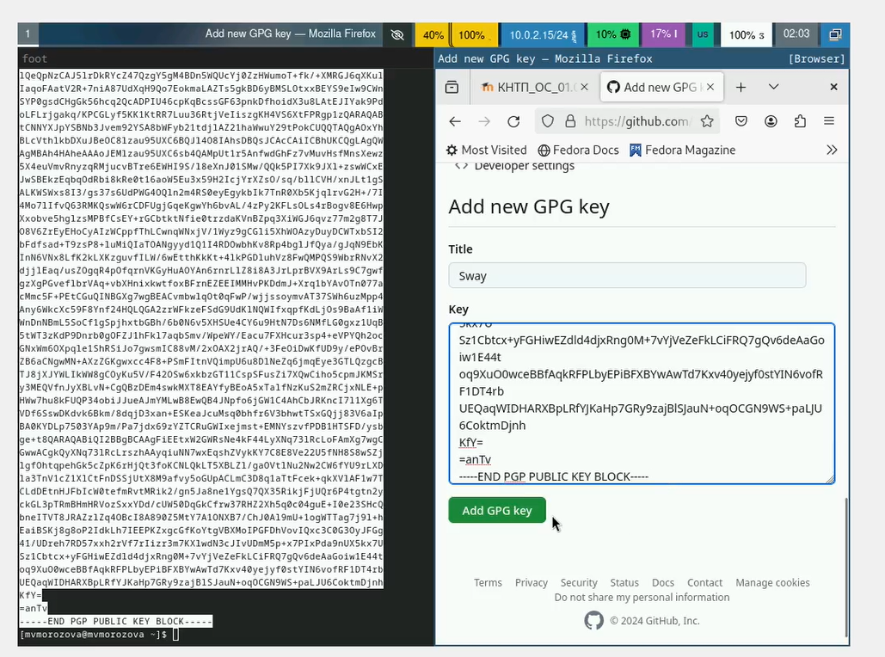
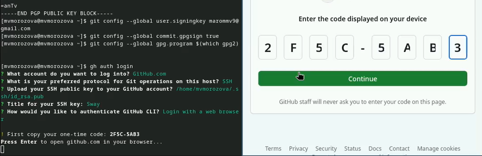
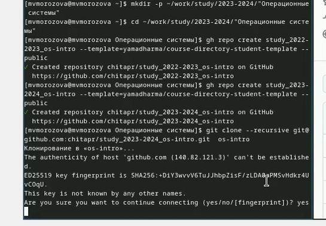
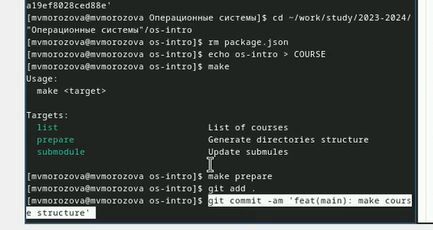

---
## Front matter
lang: ru-RU
title: Презентация по лабораторной работе №2
subtitle: Операционные системы
author:
  - Морозова  М. В.
institute:
  - Российский университет дружбы народов, Москва, Россия
date: 02 марта 2024

## i18n babel
babel-lang: russian
babel-otherlangs: english

## Formatting pdf
toc: false
toc-title: Содержание
slide_level: 2
aspectratio: 169
section-titles: true
theme: metropolis
header-includes:
 - \metroset{progressbar=frametitle,sectionpage=progressbar,numbering=fraction}
 - '\makeatletter'
 - '\beamer@ignorenonframefalse'
 - '\makeatother'

## Fonts
mainfont: PT Serif
romanfont: PT Serif
sansfont: PT Sans
monofont: PT Mono
mainfontoptions: Ligatures=TeX
romanfontoptions: Ligatures=TeX
sansfontoptions: Ligatures=TeX, Scale=MatchLowercase
monofontoptions: Scale=MatchLowercase, Scale=0.9
---

## Цели и задачи

- Изучить идеологию и применение средств контроля версий.
- Освоить умения по работе с git.
- Создать базовую конфигурацию для работы с git.
- Создать ключ  PGP.
- Настроить подписи git.
- Зарегистрироваться на  Github.
- Создать локальный каталог для выполнения заданий по предмету.

## Выполнение лабораторной работы

Установка git,  установка gh.  (рис. 1).

{width=70%}

## Выполнение лабораторной работы

Задаём имя и почту владельца репозитория, задаём имя начальной ветки, параметр autocrlf,   параметр safecrlf, создаём ключ
SSH по алгоритму  rsa (рис. 2).

{width=70%}

## Выполнение лабораторной работы

Генерируем ключ  (рис. 3).

{width=70%}

## Выполнение лабораторной работы

Выводим список ключей и копируем сгенерированный ключ. (рис. 4).

{width=70%}

## Выполнение лабораторной работы

Вставляем полученный ключ в поле ввода. (рис. 5).

{width=70%}

## Выполнение лабораторной работы

Используя введённую почту, указываю применять её при подписи коммитов, авторизация (рис. 6).

{width=70%}

## Выполнение лабораторной работы

Создаю репозиторий курса на основе шаблона.(рис. 7)
.
{width=70%}

## Выполнение лабораторной работы

Перехожу в каталог курса, удаляю лишние файлы, создаю необходимые каталоги, отправляю файлы на сервер. (рис. 8).

{width=70%}

## Выводы

Была изучена идеология и применение средств контроля версий, освоены умения по работе с git.
