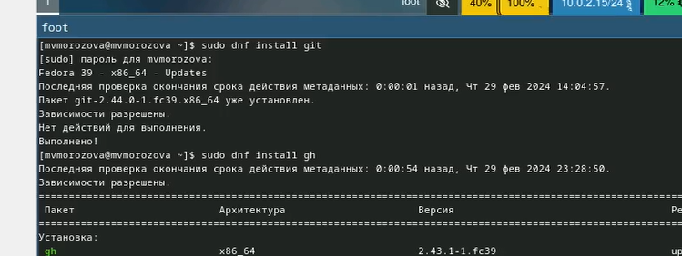
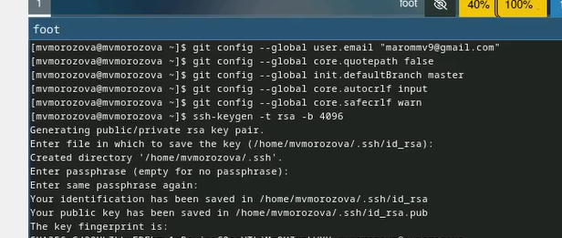
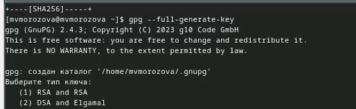
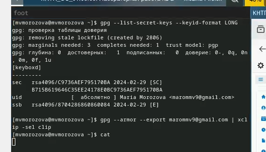
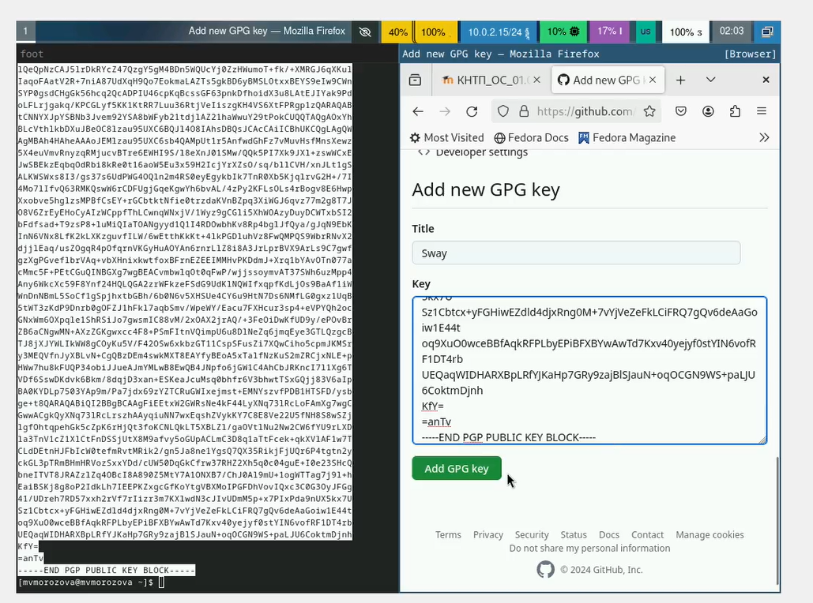
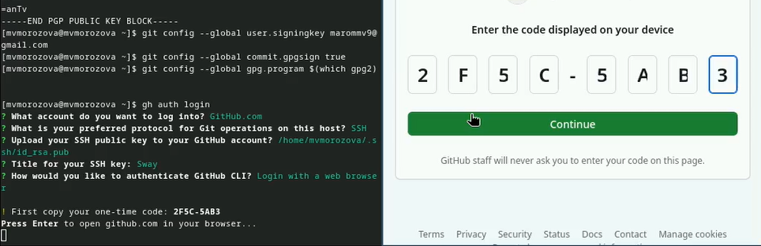
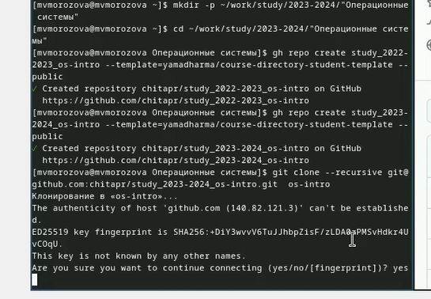
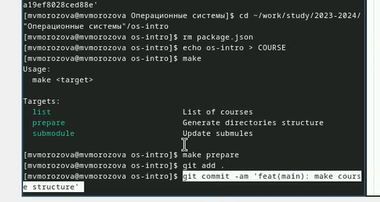

---
## Front matter
title: "Отчёт по лабораторной работе №2 "
subtitle: "Операционные системы"
author: "Морозова Мария Вячеславовна"

## Generic otions
lang: ru-RU
toc-title: "Содержание"

## Bibliography
bibliography: bib/cite.bib
csl: pandoc/csl/gost-r-7-0-5-2008-numeric.csl

## Pdf output format
toc: true # Table of contents
toc-depth: 2
lof: true # List of figures
lot: true # List of tables
fontsize: 12pt
linestretch: 1.5
papersize: a4
documentclass: scrreprt
## I18n polyglossia
polyglossia-lang:
  name: russian
  options:
	- spelling=modern
	- babelshorthands=true
polyglossia-otherlangs:
  name: english
## I18n babel
babel-lang: russian
babel-otherlangs: english
## Fonts
mainfont: PT Serif
romanfont: PT Serif
sansfont: PT Sans
monofont: PT Mono
mainfontoptions: Ligatures=TeX
romanfontoptions: Ligatures=TeX
sansfontoptions: Ligatures=TeX,Scale=MatchLowercase
monofontoptions: Scale=MatchLowercase,Scale=0.9
## Biblatex
biblatex: true
biblio-style: "gost-numeric"
biblatexoptions:
  - parentracker=true
  - backend=biber
  - hyperref=auto
  - language=auto
  - autolang=other*
  - citestyle=gost-numeric
## Pandoc-crossref LaTeX customization
figureTitle: "Рис."
tableTitle: "Таблица"
listingTitle: "Листинг"
lofTitle: "Список иллюстраций"
lotTitle: "Список таблиц"
lolTitle: "Листинги"
## Misc options
indent: true
header-includes:
  - \usepackage{indentfirst}
  - \usepackage{float} # keep figures where there are in the text
  - \floatplacement{figure}{H} # keep figures where there are in the text
---

# Цель работы

Изучить идеологию и применение средств контроля версий.
Освоить умения по работе с git.

# Задание

Создать базовую конфигурацию для работы с git. Создать ключ  SSH. Создать ключ  PGP.
Настроить подписи git. Зарегистрироваться на  Github. Создать локальный каталог для выполнения заданий по предмету.

# Выполнение лабораторной работы

Установка git,  установка gh.  (рис. [-@fig:001]).

{#fig:001 width=70%}

Задаём имя и почту владельца репозитория, задаём имя начальной ветки, параметр autocrlf,   параметр safecrlf, создаём ключ 
SSH по алгоритму  rsa (рис. [-@fig:002]).

{#fig:002 width=70%}

Генерируем ключ  (рис. [-@fig:003]).

{#fig:003 width=70%}

Выводим список ключей и копируем сгенерированный ключ. (рис. [-@fig:004]).

{#fig:004 width=70%}

Вставляем полученный ключ в поле ввода. (рис. [-@fig:005]).

{#fig:005 width=70%}

Используя введённую почту, указываю применять её при подписи коммитов, авторизация (рис. [-@fig:006]).

{#fig:006 width=70%}

Создаю репозиторий курса на основе шаблона.(рис. [-@fig:007]).

{#fig:007 width=70%}

Перехожу в каталог курса, удаляю лишние файлы, создаю необходимые каталоги, отправляю файлы на сервер. (рис. [-@fig:008]).

{#fig:008 width=70%}

# Ответы на контрольные вопросы
1.Системы контроля версий - это программное обеспечение для облегчения работы с изменяющейся информацией. Применяются при работе нескольких
 человек над одним проектом.
2.Хранилище - репозиторий, хранилище версий, в нём хранятся все документы и прочая служебная информация.
Commit - отслеживание изменений, сохраняет разницу в изменениях. История - хранит изменения в проекте и позволяет вернуться к нужным данным.
Рабочая копия - копия проекта, основанная на версии из хранилища.
3.Централизованные - одно основное хранилище всего проекта(CVS, TFS). Децентрализованные - у каждого пользователя свой вариант репозитория.
(Git,Bazaar) 
4.Сначала создаётся и подключается удаленный репозиторий, затем по мере изменения проекта эти изменения отправляются на сервер.
5.Участник проекта перед работой получает нужную версию проекта в хранилище, с помощью определенных команд после внесения изменений
 пользователь размещает новую версию в хранилище. Предыдущие версии не удаляются и к ним всегда можно вернуться.
6.Основная задача - это хранение информации об изменениях в коде, обеспечение удобной командной работы.
7.git init создание основного дерева репозитория
git diff просмотр текущих изменений
git status просмотр списка изменённых файлов в директории
8.git oush -all отправляем из локального репозитория все сохранённые изменения в центральный репозиторий, предварительно создав локальный
 репозиторий и сделав предварительную конфигурацию.
9.Ветвление - используется для разработки новых функций, один из параллельных участков в одном хранилище¸исодящих из одной версии.
10.Во время работы могут создаться файлы, которые не следует добавлять в репозиторий, например, временные файлы. Можно прописать шаблоны
 игнорируемых при добавлении в репозиторий типов  файлов в файл .gitignore с помощью сервисов. 

# Выводы

Была изучена идеология и применение средств контроля версий, освоены умения по работе с git.

