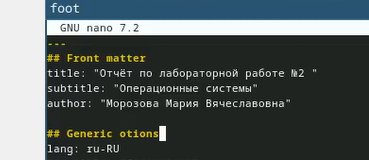
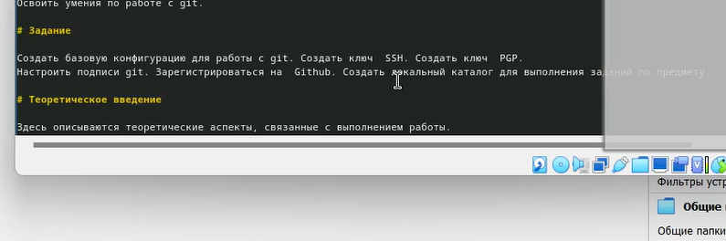
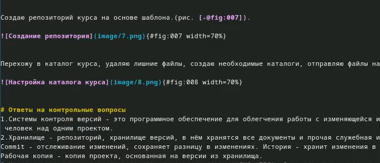
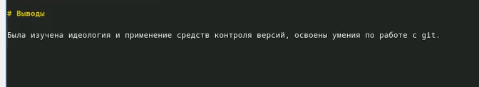

---
## Front matter
lang: ru-RU
title: Презентация по лабораторной работе №3
subtitle: Операционные системы
author:
  - Морозова М. В.
institute:
  - Российский университет дружбы народов, Москва, Россия
date: 02 марта  2024 г.

## i18n babel
babel-lang: russian
babel-otherlangs: english

## Formatting pdf
toc: false
toc-title: Содержание
slide_level: 2
aspectratio: 169
section-titles: true
theme: metropolis
header-includes:
 - \metroset{progressbar=frametitle,sectionpage=progressbar,numbering=fraction}
 - '\makeatletter'
 - '\beamer@ignorenonframefalse'
 - '\makeatother'

## Fonts
mainfont: PT Serif
romanfont: PT Serif
sansfont: PT Sans
monofont: PT Mono
mainfontoptions: Ligatures=TeX
romanfontoptions: Ligatures=TeX
sansfontoptions: Ligatures=TeX, Scale=MatchLowercase
monofontoptions: Scale=MatchLowercase, Scale=0.9
---

## Цели и задачи

-Научиться оформлять отчёты с помощью легковесного языка разметки Markdown
-Сделать отчёт по предыдущей лабораторной работе в формате Markdown

## Теоретическое введение

Markdown - облегчённый язык разметки, созданный с целью обозначения форматирования в простом тексте, с максимальным сохранением  е>
 читаемости человеком, и пригодный для машинного преобразования в языки для продвинутых публикаций.

## Выполнение лабораторной работы

Пишу номер работы, ФИО, название дисциплины (рис. 1).

{width=70%}

## Выполнение лабораторной работы

Прописываю формулировку задания работы (рис. 2).

{width=70%}

## Выполнение лабораторной работы

Подписываю названия для рисунков, описываю действия на них, отвечаю на вопросы (рис. 3).

{width=70%}

## Выполнение лабораторной работы

Пишу вывод, согласованный с заданием работы (рис. 4).

{width=70%}

## Выводы

В ходе выполнения лабораторной работы я научилась оформлять отчёты в Markdown
