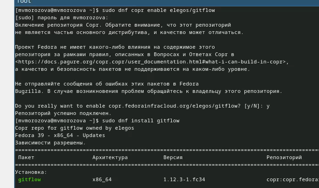
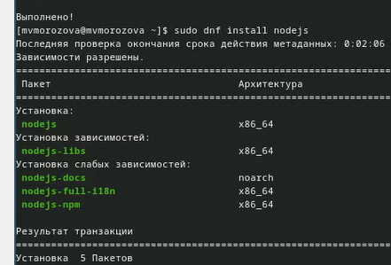
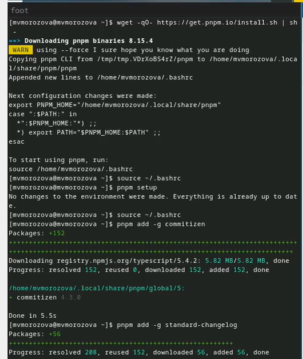
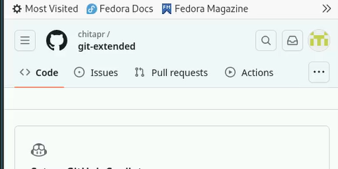
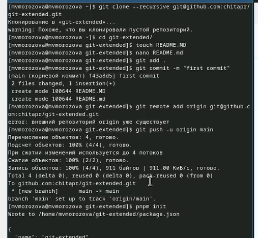
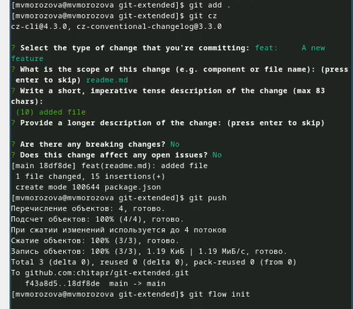
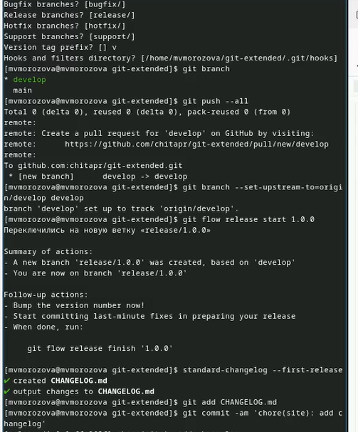
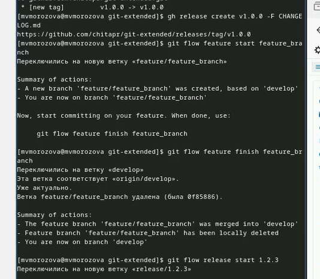
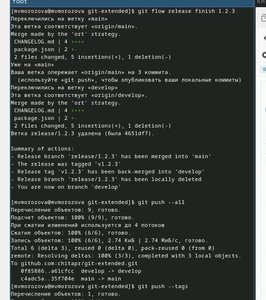
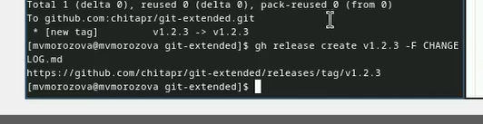

---
## Front matter
lang: ru-RU
title: Презентация по лабораторной работе №4
subtitle: Операционные системы
author:
  - Морозова  М. В.
institute:
  - Российский университет дружбы народов, Москва, Россия
date: 08 марта 2024 

## i18n babel
babel-lang: russian
babel-otherlangs: english

## Formatting pdf
toc: false
toc-title: Содержание
slide_level: 2
aspectratio: 169
section-titles: true
theme: metropolis
header-includes:
 - \metroset{progressbar=frametitle,sectionpage=progressbar,numbering=fraction}
 - '\makeatletter'
 - '\beamer@ignorenonframefalse'
 - '\makeatother'

## Fonts
mainfont: PT Serif
romanfont: PT Serif
sansfont: PT Sans
monofont: PT Mono
mainfontoptions: Ligatures=TeX
romanfontoptions: Ligatures=TeX
sansfontoptions: Ligatures=TeX, Scale=MatchLowercase
monofontoptions: Scale=MatchLowercase, Scale=0.9
---

## Цели и задачи

- Получение навыков правильной работы с репозиториями git.
- Выполнить работу для тестового репозитория.
- Преобразовать рабочий репозиторий в репозиторий с git-flow  и
 conventional commits.

## Выполнение лабораторной работы

Установка git-flow из коллекции репозиториев corp.  (рис. 1).

{width=70%}

## Выполнение лабораторной работы

Установка node.js (рис. 2).

{width=70%}

## Выполнение лабораторной работы

Настройка node.js и общепринятых коммитов.(рис. 3).

{width=70%}

## Выполнение лабораторной работы

Создали репозиторий git. (рис. 4).

{width=70%}

## Выполнение лабораторной работы

Делаем первый коммит и выкладываем на github.(рис. 5).

{width=70%}

## Выполнение лабораторной работы

Заполнили название и лицензию пакета. (рис. 6).

{width=70%}

## Выполнение лабораторной работы

Выгружаем на github, инициализируем  git-flow. (рис. 7).

{width=70%}

## Выполнение лабораторной работы

Установим префикс для ярлыков в v, проверили на какой мы ветке, загрузили репозиторий в хранилище. (рис. 8).

{width=70%}

## Выполнение лабораторной работы

Создали релиз на github, создадим ветку для новой функциональности, объединяем ветки, создаем релиз 1.2.3(рис. 9).

{width=70%}

## Выполнение лабораторной работы

Залили релизную ветку в основную ветку, отправили данные на github. (рис. 10).

{width=70%}

## Выполнение лабораторной работы

Создали на github релиз с комментарием из журнала изменений. (рис. 11).

{width=70%}

## Выводы

В процессе выполнения лабораторной работы были получены навыки правильной работы с репозиториями git.
